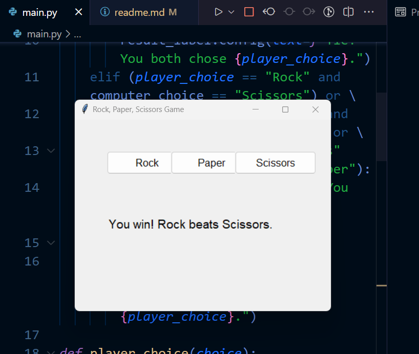

# Rock, Paper, Scissors Game



## Overview

This is a simple Rock, Paper, Scissors game implemented in Python with a graphical user interface (GUI) using the Tkinter library. Test your luck and decision-making skills against the computer in this classic hand game!

## How to Play

1. Clone or download the repository to your local machine.

2. Make sure you have Python installed on your computer.

3. Run the game by executing the `main.py` script using Python.

   ```bash
   python main.py


1 - A graphical window will open with buttons for "Rock," "Paper," and "Scissors."

2 -  Click on one of the buttons to make your choice.

3 -  The computer will randomly select its choice.

4 -  The result of the game will be displayed on the screen, indicating whether you win, lose, or tie.

5 -  Enjoy playing and see if you can outsmart the computer!

## **Features :**
- Simple and clean graphical interface.
- Classic Rock, Paper, Scissors gameplay.
- Randomized computer choice for unpredictability.

## **Requirements :**
- Python 3.x
- Tkinter (usually included with Python)

## **Contributions :**
Contributions are welcome! Feel free to fork the project, make improvements, and submit a pull request. You can also open issues to report bugs or suggest enhancements.

